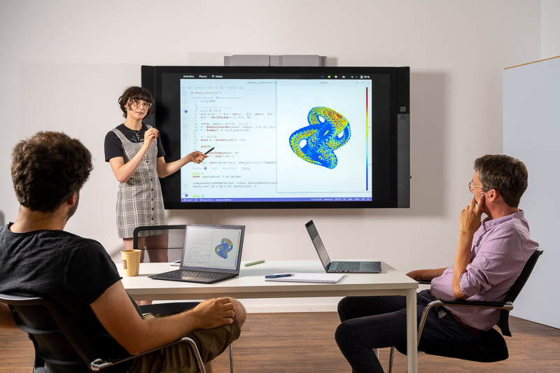

## 2025

- [On the Subtle Importance of Function Spaces in Koopman Eigenmode Decompositions](https://meetings.siam.org/sess/dsp_talk.cfm?p=144454) SIAM Conference on Applications of Dynamical Systems (DS25). Denver, CO, US

## 2024

- 2024.07.10: [GAIO.jl: Fast, Elegant Set-Oriented Numerical Methods](https://youtu.be/iQrVzOOJo6Y?si=ZuiSfbF_-63H1ucM) 2024 International Conference on the Julia Programming Language. Eindhoven, NL

## 2023

- 2023.11.27: Introduction to Pseudospectra with an Outlook to Koopman Operators. Research Seminar Computational Dynamics. Munich, DE
- 2023.05.14: [Set-Oriented Numerical Methods for Dynamical Systems](https://meetings.siam.org/sess/dsp_talk.cfm?p=132588) [(slides)](https://github.com/April-Hannah-Lena/talk_GAIO.jl/blob/main/GAIO_on_julia_1.9.pdf). SIAM Conference on Applications of Dynamical Systems (DS23). Portland, OR, US
- 2023.05.02: On the Determinants of Trace-class Operators: Lidskii's Theorem and Applications. Research Seminar Computational Dynamics. Munich, DE

## 2022

- 2023.09.30: [GAIO - 25 Years Later](https://sites.google.com/view/son-2020/home/program?authuser=0). International Workshop on Dynamics, Optimization, and Computation (SON2022). Paderborn, DE
